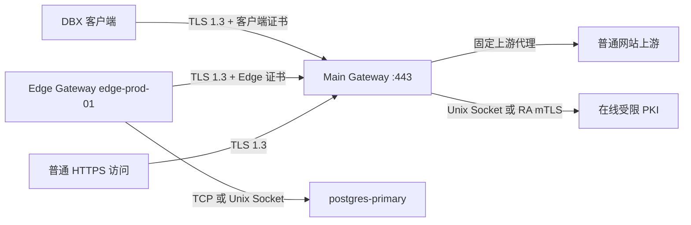

# DBX Gateway 部署总览

DBX Gateway 把 DBX 客户端到数据库的长连接拆成两段受控链路：公网或不可信内网中的客户端连接 Main Gateway，数据库附近的 Edge Gateway 主动连接 Main，再由 Edge 访问已配置的数据库目标。示例统一使用：

- 域名：`gateway.example.com`
- Main 端口：`443`
- Edge ID：`edge-prod-01`
- 目标 ID：`postgres-primary`
- 配置目录：`/etc/dbx-gateway`
- Gateway 数据目录：`/var/lib/dbx-gateway`
- PKI 数据目录：`/var/lib/dbx-gateway-pki`

## 网络拓扑

Main 不需要访问数据库地址。Edge 只向 Main 注册逻辑目标 ID，Main 的状态库不保存数据库真实地址。DBX 客户端选择 `edge-prod-01 / postgres-primary` 后，Main 才要求对应 Edge 建立一次性数据通道。

## 信任边界

- DBX 到 Main：TLS 1.3 双向认证。沿途交换机、路由器、代理和抓包节点能看到源/目的 IP、端口、连接时长、包长、时序、SNI 等 TLS 元数据，看不到 SQL、密码和结果内容。
- Edge 到 Main：TLS 1.3 双向认证，网络观察结果同上。Edge 证书 URI SAN 与 Edge ID 绑定，另一张证书不能冒用相同身份。
- Main 进程：终止两侧 TLS 并做透明字节转发，因此能读取数据库认证交换、SQL 和结果数据。Main 主机必须按敏感基础设施保护。
- Edge 进程：终止 Main 到 Edge 的 TLS，并自行从 Edge 主机建立到数据库的新连接。数据库和数据库侧网络看到的是 Edge 主机的 IP 与 `dbx-gateway` 进程，不会看到原 DBX 客户端的源 IP 或客户端进程名。
- Edge 到数据库：使用数据库原生连接。数据库支持 TLS 时应继续启用数据库 TLS；数据库不支持 TLS 时，这一小段链路是明文，必须把 Edge 部署在数据库同机、同可信安全区，或使用 Unix Socket。
- PKI：Root CA 应离线保存。在线服务只允许签发 Edge `clientAuth` 证书，不提供网络接口签发 Server 或 DBX Client 证书。

普通 HTTPS 回退不会降低保留路径安全性。`/_dbx/edge`、`/_dbx/edge/data`、`/_dbx/client`、`/_dbx/enroll`、`/_dbx/renew` 总是先分类；身份错误时返回 TLS 失败或 `404`，不会转发到普通网站上游。

## 前置代理

公网可以直接把 `gateway.example.com:443` 指向 Main，并使用用户申请的受信 Server 证书。当前版本不内置 ACME，证书申请和续期由现有 CA、certbot 或企业证书平台完成。

Nginx、HAProxy 或云负载均衡只能使用 TCP/TLS passthrough。不能在前置代理终止 TLS 后再以普通 HTTP 转发，因为 Main 需要直接验证 DBX/Edge 客户端证书，且协议升级和证书身份都属于端到端连接。

## 最短部署顺序

1. 在离线或严格受控主机初始化 PKI，备份 Root 与三个中间 CA。
2. 在 PKI 主机启动只监听 Unix Socket 的在线受限 PKI。
3. 为 Main 签发 `gateway.example.com` Server 证书并启动 Main。
4. 为 DBX 用户签发 `client.p12`，安全导入桌面客户端。
5. 创建 10 分钟一次性 Edge 注册令牌，在 Edge 主机保存为 `0600` 文件。
6. 启动 Edge；Edge 本地生成私钥、经 Main 领证、删除令牌并用 mTLS 重新连接。
7. 在 DBX 连接中选择 `edge-prod-01 / postgres-primary` 并测试链路。

## 文档入口

- [Main Gateway 部署](dbx-gateway/main-gateway.md)
- [Edge Gateway 部署](dbx-gateway/edge-gateway.md)
- [PKI 与证书](dbx-gateway/pki.md)
- [配置字段参考](dbx-gateway/configuration.md)
- [运维、监控与排障](dbx-gateway/operations.md)

发布包内还包含可直接修改的 `examples/*.toml` 和三套 `systemd/*.service`。所有命令先在测试环境执行，确认 UID/GID、证书路径和防火墙规则符合实际主机。
