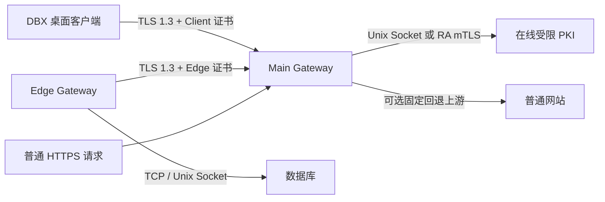

# DBX Gateway 部署与使用说明书

本文用于在 Linux 上部署 DBX Gateway 的 Main、Edge 和在线 PKI，并在 DBX 桌面端通过双向 TLS 访问数据库。示例约定如下，部署前请替换为实际值：

| 项目 | 示例值 |
|---|---|
| Main 域名 | `gateway.example.com` |
| Main 监听端口 | `443` |
| Edge ID | `edge-prod-01` |
| 数据库目标 ID | `postgres-primary` |
| DBX Client 身份 | `desktop-prod` |
| Gateway 配置目录 | `/etc/dbx-gateway` |
| Gateway 数据目录 | `/var/lib/dbx-gateway` |
| 在线 PKI 配置目录 | `/etc/dbx-gateway-pki` |
| 在线 PKI 数据目录 | `/var/lib/dbx-gateway-pki` |

没有域名时可以直接使用固定 IP，例如 `10.235.10.53`。证书 SAN 类型必须与 URL 一致：域名使用 `--dns-san`，IP 地址使用 `--ip-san`。不能把 IP 字符串写入 `--dns-san`。

## 1. 架构与安全边界



- DBX 和 Edge 都主动连接 Main，不需要从 Main 向数据库网段开放入站端口。
- Main 只保存 Edge ID 和 target ID，不保存数据库真实地址。
- 数据库连接由 Edge 主机上的 `dbx-gateway` 进程建立。数据库侧看到 Edge IP，不会看到 DBX 客户端 IP 或客户端进程名。
- DBX 到 Main、Edge 到 Main 均使用 TLS 1.3 双向认证。网络中间节点能看到 IP、端口、SNI、包长和时序，不能读取 SQL、密码和查询结果。
- Main 和 Edge 是 TLS 终止端，进程及主机管理员能够接触转发明文，应按敏感基础设施保护。
- Edge 到数据库使用数据库原生协议。数据库不支持 TLS 时，优先将 Edge 部署在数据库同机并使用 Unix Socket。
- PKI Root CA 应离线保存。在线 PKI 只持有 Edge CA，只允许签发 Edge `clientAuth` 证书。

## 2. 部署准备

### 2.1 主机规划

建议至少规划以下角色：

1. 离线 PKI 主机：初始化 Root、Server、Client、Edge 四类 CA，签发 Main 和 DBX Client 证书。
2. Main 主机：公网或跨网入口；可与在线 PKI 同机。
3. Edge 主机：位于数据库同机或数据库所在安全区。
4. DBX 桌面客户端：导入 Client PKCS#12 身份并选择逻辑路由。

测试环境可把离线 PKI、在线 PKI 和 Main 放在一台 Linux 主机，但生产环境至少应把完整 Root PKI 离线保存。

### 2.2 网络规则

| 来源 | 目标 | 端口 | 说明 |
|---|---|---:|---|
| DBX 客户端 | Main | `443/tcp` | WSS + mTLS |
| Edge | Main | `443/tcp` | WSS + mTLS、首次领证和续期 |
| Main 本机 | 健康检查 | `9080/tcp` | 只监听 loopback |
| Edge | 数据库 | 数据库端口或 Unix Socket | 由 Edge 主动建立 |
| Main | 在线 PKI | Unix Socket | 默认 `/run/dbx-gateway/pki.sock` |

若 Main 前置 Nginx、HAProxy 或云负载均衡，只能做 TCP/TLS passthrough，不能终止 TLS。Main 必须直接取得 Client 和 Edge 证书。

### 2.3 安装包

下载与服务器架构匹配的包：

```text
DBX_Gateway_<版本>_x64.tar.gz
DBX_Gateway_<版本>_arm64.tar.gz
```

在每台 Linux 主机校验并解包：

```bash
sha256sum -c DBX_Gateway_0.5.75_x64.tar.gz.sha256
tar -xzf DBX_Gateway_0.5.75_x64.tar.gz
cd DBX_Gateway_0.5.75_x64
./bin/dbx-gateway --version
./bin/dbx-gateway-pki --version
```

也可从源码构建：

```bash
cargo build --release -p dbx-gateway
```

生成的程序为 `target/release/dbx-gateway` 和 `target/release/dbx-gateway-pki`。

## 3. 初始化离线 PKI

本节所有命令都在**离线 PKI 主机**执行。下面两个路径含义不同：

| 路径 | 谁创建 | 用途 | 是否交付给其他主机 |
|---|---|---|---|
| `/secure/dbx-pki-password` | 管理员先创建 | 解密 CA 私钥的密码文件 | 只向在线 PKI 交付一份受控副本 |
| `/secure/dbx-gateway-pki-offline` | `init` 命令创建 | 完整 PKI 数据库 | 绝不能整体复制到在线主机 |

先创建密码文件，再初始化 PKI：

```bash
umask 077
install -d -m 0700 /secure/dbx-gateway-pki-offline
printf '%s\n' 'REPLACE_WITH_LONG_RANDOM_CA_PASSWORD' > /secure/dbx-pki-password
chmod 0600 /secure/dbx-pki-password

dbx-gateway-pki init \
  --data-dir /secure/dbx-gateway-pki-offline \
  --password-file /secure/dbx-pki-password
```

预期输出 `initialized DBX Gateway PKI`。命令生成以下文件；这些是 CA，不是 Main、Edge 或 DBX 用户的叶证书：

```text
/secure/dbx-gateway-pki-offline/
├── root/                 # Root CA，只留在离线主机
├── server/               # Server CA，用于签发 Main Server 证书
│   └── ca.crt.pem
├── edge/                 # Edge CA，用于签发 Edge 身份
│   ├── ca.crt.pem
│   └── ca.key.encrypted.pem
└── client/               # Client CA，用于签发 DBX Client 身份
    └── ca.crt.pem
```

初始化命令不会输出 `/secure/dbx-pki-password`，也不会覆盖已有 PKI。

立即制作至少两份加密离线备份。完整 PKI、CA 密码和备份恢复说明应分开保管，不要将 Root、Server 或 Client CA 私钥复制到 Main 或 Edge。

## 4. 签发 Main Server 证书

本节命令仍在**离线 PKI 主机**执行。它从完整 PKI 的 `server` CA 签发 Main 的 HTTPS 服务端证书。

**有域名时**，使用 DNS SAN：

```bash
dbx-gateway-pki server issue \
  --data-dir /secure/dbx-gateway-pki-offline \
  --password-file /secure/dbx-pki-password \
  --identity gateway.example.com \
  --dns-san gateway.example.com \
  --output-dir /secure/export/main-server
```

此证书对应 `wss://gateway.example.com/...` 和 `https://gateway.example.com/...`。

**没有域名、直接使用 IP 时**，必须使用 IP SAN：

```bash
dbx-gateway-pki server issue \
  --data-dir /secure/dbx-gateway-pki-offline \
  --password-file /secure/dbx-pki-password \
  --identity main-gateway \
  --dns-san localhost \
  --ip-san 10.235.10.53 \
  --output-dir /secure/export/main-server-ip
```

当前 CLI 要求至少填写一个 `--dns-san`，所以纯 IP 场景用 `localhost` 占位；真正让 `wss://10.235.10.53/...` 通过校验的是 `--ip-san 10.235.10.53`。不要写成 `--dns-san 10.235.10.53`。

签发后必须检查 SAN：

```bash
openssl x509 \
  -in /secure/export/main-server-ip/certificate.pem \
  -noout -text | grep -A2 "Subject Alternative Name"
```

纯 IP 场景应看到 `IP Address:10.235.10.53`。如果只看到 `DNS:10.235.10.53`，该证书不能用于 IP URL，必须重新签发。

域名命令创建 `/secure/export/main-server`；纯 IP 命令创建 `/secure/export/main-server-ip`。下表用 `<MAIN_SERVER_OUTPUT>` 表示你实际选择的那个目录：

| 生成文件 | 用途 | 最终位置 |
|---|---|---|
| `<MAIN_SERVER_OUTPUT>/certificate.pem` | Main 的叶证书 | Main 的 `/etc/dbx-gateway/certs/main.pem` 首段 |
| `<MAIN_SERVER_OUTPUT>/chain.pem` | Main Server CA 证书链 | 追加到 Main 的 `main.pem`；同时作为 DBX 和 Edge 信任 Main 的 CA PEM |
| `<MAIN_SERVER_OUTPUT>/private-key.pem` | Main 服务端私钥 | Main 的 `/etc/dbx-gateway/certs/main.key`，权限必须为 `0600` |

另外从完整 PKI 取出两个**公开 CA 证书**交给 Main：

| 源文件 | Main 最终位置 | Main 用它验证谁 |
|---|---|---|
| `/secure/dbx-gateway-pki-offline/edge/ca.crt.pem` | `/etc/dbx-gateway/certs/edge-ca.pem` | Edge Gateway |
| `/secure/dbx-gateway-pki-offline/client/ca.crt.pem` | `/etc/dbx-gateway/certs/client-ca.pem` | DBX Client |

不要把 `edge/ca.key.encrypted.pem`、`client/ca.key.encrypted.pem` 或 Root 私钥交给 Main。

## 5. 部署在线 Edge PKI

在线 PKI 只负责 Edge 自动领证。它需要离线 PKI 的 `edge` CA 证书、加密私钥和同一个 CA 密码，不需要 Root、Server 或 Client CA 私钥。

在在线 PKI/Main 主机以 `root` 执行：

```bash
groupadd --system dbx-gateway
useradd --system --gid dbx-gateway --home-dir /var/lib/dbx-gateway --shell /usr/sbin/nologin dbx-gateway
useradd --system --gid dbx-gateway --home-dir /var/lib/dbx-gateway-pki --shell /usr/sbin/nologin dbx-gateway-pki

install -d -o root -g dbx-gateway -m 0750 /etc/dbx-gateway-pki
install -d -o dbx-gateway-pki -g dbx-gateway -m 0700 /var/lib/dbx-gateway-pki
install -m 0755 bin/dbx-gateway-pki /usr/bin/dbx-gateway-pki
install -m 0640 examples/pki.toml /etc/dbx-gateway-pki/pki.toml
```

通过加密介质把下面三个源文件送到在线 PKI 主机，然后执行明确的安装命令：

| 离线 PKI 主机上的源文件 | 在线 PKI 主机上的目标文件 |
|---|---|
| `/secure/dbx-gateway-pki-offline/edge/ca.crt.pem` | `/var/lib/dbx-gateway-pki/edge/ca.crt.pem` |
| `/secure/dbx-gateway-pki-offline/edge/ca.key.encrypted.pem` | `/var/lib/dbx-gateway-pki/edge/ca.key.encrypted.pem` |
| `/secure/dbx-pki-password` | `/etc/dbx-gateway-pki/password` |

假设加密介质挂载在 `/mnt/secure-transfer`：

```bash
install -d -o dbx-gateway-pki -g dbx-gateway -m 0700 \
  /var/lib/dbx-gateway-pki/edge
install -o dbx-gateway-pki -g dbx-gateway -m 0644 \
  /mnt/secure-transfer/edge/ca.crt.pem \
  /var/lib/dbx-gateway-pki/edge/ca.crt.pem
install -o dbx-gateway-pki -g dbx-gateway -m 0600 \
  /mnt/secure-transfer/edge/ca.key.encrypted.pem \
  /var/lib/dbx-gateway-pki/edge/ca.key.encrypted.pem
install -o dbx-gateway-pki -g dbx-gateway -m 0600 \
  /mnt/secure-transfer/dbx-pki-password \
  /etc/dbx-gateway-pki/password
```

`/mnt/secure-transfer` 只是示例挂载点，不是程序固定目录。安装完成后卸载并妥善清理传输介质。

查询 Main 服务账号的 UID/GID：

```bash
id -u dbx-gateway
id -g dbx-gateway
```

将结果写入 `/etc/dbx-gateway-pki/pki.toml`：

```toml
data_dir = "/var/lib/dbx-gateway-pki"
password_file = "/etc/dbx-gateway-pki/password"
state_file = "/var/lib/dbx-gateway-pki/gateway-state.sqlite3"

[unix]
path = "/run/dbx-gateway/pki.sock"
allowed_uid = 991 # 替换为实际 UID
allowed_gid = 991 # 替换为实际 GID
```

安装并启动：

```bash
install -m 0644 systemd/dbx-gateway-pki.service /etc/systemd/system/
systemctl daemon-reload
systemctl enable --now dbx-gateway-pki.service
systemctl status dbx-gateway-pki.service --no-pager
```

确认 `/run/dbx-gateway/pki.sock` 权限为 `0660`，且在线数据目录不存在 Root、Server、Client CA 私钥。

## 6. 部署 Main Gateway

### 6.1 安装文件

在 Main 主机以 `root` 执行：

先确保传输目录中放的是与你连接方式匹配的签发结果：域名使用 `/secure/export/main-server`，纯 IP 使用 `/secure/export/main-server-ip`。以下命令统一假设它已复制为 `/mnt/secure-transfer/main-server`。

```bash
install -d -o root -g dbx-gateway -m 0750 /etc/dbx-gateway /etc/dbx-gateway/certs
install -d -o dbx-gateway -g dbx-gateway -m 0750 /var/lib/dbx-gateway /run/dbx-gateway
install -m 0755 bin/dbx-gateway /usr/bin/dbx-gateway
install -m 0640 examples/main.toml /etc/dbx-gateway/main.toml

install -o root -g dbx-gateway -m 0644 \
  /mnt/secure-transfer/main-server/certificate.pem \
  /etc/dbx-gateway/certs/main.pem
cat /mnt/secure-transfer/main-server/chain.pem >> \
  /etc/dbx-gateway/certs/main.pem
install -o dbx-gateway -g dbx-gateway -m 0600 \
  /mnt/secure-transfer/main-server/private-key.pem \
  /etc/dbx-gateway/certs/main.key
install -o root -g dbx-gateway -m 0644 \
  /mnt/secure-transfer/edge-ca.crt.pem \
  /etc/dbx-gateway/certs/edge-ca.pem
install -o root -g dbx-gateway -m 0644 \
  /mnt/secure-transfer/client-ca.crt.pem \
  /etc/dbx-gateway/certs/client-ca.pem
```

这里的 `chain.pem` 是 Main Server CA 链。DBX 客户端和 Edge 主机导入的 “Main Server CA PEM” 也是这个文件，不是 `edge-ca.pem` 或 `client-ca.pem`。

### 6.2 配置 Main

编辑 `/etc/dbx-gateway/main.toml`：

```toml
mode = "main"
listen = "0.0.0.0:443"
health_listen = "127.0.0.1:9080"
state_file = "/var/lib/dbx-gateway/main-state.sqlite3"
certificate = "/etc/dbx-gateway/certs/main.pem"
private_key = "/etc/dbx-gateway/certs/main.key"
edge_ca_certificate = "/etc/dbx-gateway/certs/edge-ca.pem"
client_ca_certificate = "/etc/dbx-gateway/certs/client-ca.pem"
edge_path = "/_dbx/edge"
dbx_path = "/_dbx/client"
fallback_upstream = "https://www.example.com"
allowed_edge_ids = ["edge-prod-01"]

[client_route_acl]
desktop-prod = ["edge-prod-01/postgres-primary"]

[enrollment]
path = "/_dbx/enroll"
renewal_path = "/_dbx/renew"
allowed_edge_ids = ["edge-prod-01"]

[enrollment.pki]
unix_socket = "/run/dbx-gateway/pki.sock"
```

`desktop-prod` 必须与 Client 证书 URI SAN 中的身份一致。ACL 支持精确路由 `edge/target`、Edge 通配 `edge/*` 和全部路由 `*/*`。生产环境不建议使用 `*/*`。

`fallback_upstream` 可省略。配置后，普通 HTTPS 请求会反向代理到这个固定 URL；DBX 保留路径上的身份失败不会转发到普通网站。

校验并启动：

```bash
sudo -u dbx-gateway dbx-gateway --config /etc/dbx-gateway/main.toml check-config
install -m 0644 systemd/dbx-gateway-main.service /etc/systemd/system/
systemctl daemon-reload
systemctl enable --now dbx-gateway-main.service
curl -fsS http://127.0.0.1:9080/healthz
```

预期配置校验输出 `configuration is valid`，systemd 状态为 `active (running)`，健康接口返回 `status: ok`。

### 6.3 Nginx TCP 透传（可选）

Main 若监听 `127.0.0.1:8443`，Nginx 可使用 `stream` 模块透传：

```nginx
stream {
    upstream dbx_main {
        server 127.0.0.1:8443;
    }

    server {
        listen 443;
        proxy_pass dbx_main;
        proxy_connect_timeout 5s;
        proxy_timeout 1h;
    }
}
```

不要使用 `http { proxy_pass ... }` 终止 TLS。

## 7. 签发并导入 DBX Client 身份

完整步骤见 [DBX Client 证书生成与交付](client-certificate.md)。本节只保留部署主线。

在**离线 PKI 主机**先创建本次 `client.p12` 专用的 bundle 密码文件，再签发：

```bash
umask 077
openssl rand -base64 32 > /secure/client-bundle-password
chmod 0600 /secure/client-bundle-password

dbx-gateway-pki client issue \
  --data-dir /secure/dbx-gateway-pki-offline \
  --password-file /secure/dbx-pki-password \
  --bundle-password-file /secure/client-bundle-password \
  --identity desktop-prod \
  --output-dir /secure/export/desktop-prod
```

命令输出目录中的文件用途：

| 文件 | 用途 | 是否交付给 DBX 用户 |
|---|---|---|
| `/secure/export/desktop-prod/client.p12` | 包含 Client 证书、私钥和证书链的导入包 | 是 |
| `/secure/client-bundle-password` | 解锁这个 `client.p12` 的导入密码 | 是，与 `.p12` 分渠道 |
| `certificate.pem`、`chain.pem`、`private-key.pem` | PEM 形式的同一 Client 身份，主要用于管理员检查或非 DBX 集成 | DBX 桌面端不需要 |
| `/secure/dbx-pki-password` | CA 私钥密码 | 绝不交付 |

还要把 Main 签发目录中的 `/secure/export/main-server/chain.pem` 交付给用户，作为 DBX 中的 **Main Server CA PEM**。它与 `client.p12` 的 bundle 密码无关。

DBX 桌面端操作：

1. 打开 `设置 > 隧道`，新增 Gateway。
2. 在“导入身份”中点击“选择 PKCS#12”并选择 `client.p12`；点击密码框右侧的文件按钮选择 bundle 密码文件，DBX 会自动填入密码，也可手工输入。
3. 文件和密码准备完成后，点击同一行最右侧的“导入”。
4. Main URL 填写 `wss://gateway.example.com/_dbx/client`。
5. 选择导入的 Client 身份，并把 Main 签发目录中的 `chain.pem` 导入为 Main Server CA PEM。
6. 可选填写 Main Server SPKI SHA-256 Pin。
7. 点击“测试 Main”，成功后保存 Gateway 档案。

纯 IP 部署时第 4 步改为 `wss://10.235.10.53/_dbx/client`，并确保 Main 证书包含 `IP Address:10.235.10.53` SAN。

私钥进入系统钥匙串，不会写入普通 SQLite 字段或连接导出文件。浏览器版不支持 Gateway 客户端身份。

## 8. 部署 Edge Gateway

Edge 身份不会由管理员生成一个 `client.p12` 再复制过去。标准流程是创建一次性注册令牌，由 Edge 在本机生成私钥和 CSR，再通过 Main 向在线 PKI 领取证书。完整步骤见 [Edge 节点证书生成与领取](edge-certificate.md)。

### 8.1 安装

在 Edge 主机以 `root` 执行：

```bash
groupadd --system dbx-gateway
useradd --system --gid dbx-gateway --home-dir /var/lib/dbx-gateway --shell /usr/sbin/nologin dbx-gateway
install -d -o root -g dbx-gateway -m 0750 /etc/dbx-gateway /etc/dbx-gateway/certs
install -d -o dbx-gateway -g dbx-gateway -m 0700 /var/lib/dbx-gateway
install -m 0755 bin/dbx-gateway /usr/bin/dbx-gateway
install -m 0640 examples/edge.toml /etc/dbx-gateway/edge.toml
install -m 0644 /mnt/secure-transfer/main-server/chain.pem \
  /etc/dbx-gateway/certs/main-server-ca.pem
```

纯 IP 部署时，这两个 URL 必须同时改为证书 `--ip-san` 中的同一个 IP：

```toml
main_url = "wss://10.235.10.53/_dbx/edge"

[bootstrap]
enrollment_url = "https://10.235.10.53/_dbx/enroll"
```

计算并通过另一可信渠道核对 Main 证书 SPKI Pin：

```bash
openssl x509 -in main.pem -pubkey -noout \
  | openssl pkey -pubin -outform DER \
  | openssl dgst -sha256 -hex \
  | awk '{print $NF}'
```

### 8.2 配置 Edge 和数据库目标

编辑 `/etc/dbx-gateway/edge.toml`：

```toml
mode = "edge"
edge_id = "edge-prod-01"
main_url = "wss://gateway.example.com/_dbx/edge"
certificate = "/var/lib/dbx-gateway/edge.pem"
private_key = "/var/lib/dbx-gateway/edge.key"
ca_certificate = "/etc/dbx-gateway/certs/main-server-ca.pem"

[bootstrap]
token_file = "/var/lib/dbx-gateway/enrollment.token"
enrollment_url = "https://gateway.example.com/_dbx/enroll"
server_spki_sha256 = "REPLACE_WITH_64_HEX_CHARACTERS"
renew_before_days = 30

[targets.postgres-primary]
display_name = "PostgreSQL Primary"
address = "127.0.0.1:5432"
allow_remote = false
```

数据库同机时优先使用 Unix Socket：

```toml
[targets.postgres-primary]
display_name = "PostgreSQL Primary"
address = { unix = "/run/postgresql/.s.PGSQL.5432" }
```

数据库位于另一台内网主机时必须显式允许远程地址：

```toml
[targets.postgres-primary]
address = "10.20.30.40:5432"
allow_remote = true
```

Edge 会拒绝未显式允许的远程地址、组播、link-local、未指定地址和云元数据地址。Main 只会看到 `postgres-primary`，不会看到 `10.20.30.40:5432`。

### 8.3 创建一次性注册令牌

在在线 PKI 主机以 `dbx-gateway-pki` 用户执行：

```bash
sudo -u dbx-gateway-pki dbx-gateway-pki enrollment create \
  --data-dir /var/lib/dbx-gateway-pki \
  --edge-id edge-prod-01 \
  --ttl 10m
```

明文令牌只显示一次。通过受控通道送到 Edge，然后在 Edge 主机执行：

```bash
umask 077
printf '%s\n' 'REPLACE_WITH_ONE_TIME_TOKEN' > /var/lib/dbx-gateway/enrollment.token
chown dbx-gateway:dbx-gateway /var/lib/dbx-gateway/enrollment.token
chmod 0600 /var/lib/dbx-gateway/enrollment.token
```

### 8.4 启动 Edge

```bash
sudo -u dbx-gateway dbx-gateway --config /etc/dbx-gateway/edge.toml check-config
install -m 0644 systemd/dbx-gateway-edge.service /etc/systemd/system/
systemctl daemon-reload
systemctl enable --now dbx-gateway-edge.service
journalctl -u dbx-gateway-edge.service -f
```

首次启动时 Edge 在本地生成私钥，使用令牌提交 CSR，写入 `/var/lib/dbx-gateway/edge.pem` 和 `edge.key`，删除令牌文件，然后以 mTLS 重连 Main。Main 和 PKI 不会收到 Edge 私钥。

首次启动后的两个产物用途如下：

| Edge 本机文件 | 谁生成 | 用途 |
|---|---|---|
| `/var/lib/dbx-gateway/edge.pem` | Edge 自动写入 | Edge 叶证书和证书链，对应 `certificate` |
| `/var/lib/dbx-gateway/edge.key` | Edge 本机生成 | Edge 私钥，对应 `private_key`，不得离开 Edge 主机 |

## 9. 在 DBX 中使用 Gateway 路由

1. 新建或编辑数据库连接，进入“传输”选项卡。
2. 添加 Gateway 传输层。每条连接最多一个 Gateway，且必须位于传输链最后一层。
3. 选择前面保存的共享 Gateway 档案。
4. 点击刷新，读取当前 Client 身份获准访问的逻辑路由。
5. 选择 `edge-prod-01 / postgres-primary`。
6. 点击“测试连接”。链路图会分别显示 DBX、SSH/Proxy、Main、Edge 和数据库节点状态。
7. 测试成功后保存连接。

连接配置只保存 Gateway 档案 ID、Edge ID 和 target ID，不保存证书密码、私钥或数据库真实地址。

## 10. 部署验收

### 10.1 服务状态

Main/PKI 主机：

```bash
systemctl is-active dbx-gateway-main.service dbx-gateway-pki.service
curl -fsS http://127.0.0.1:9080/healthz
journalctl -u dbx-gateway-main.service --since '-10 min' --no-pager
```

Edge 主机：

```bash
systemctl is-active dbx-gateway-edge.service
journalctl -u dbx-gateway-edge.service --since '-10 min' --no-pager
ss -tnp | grep dbx-gateway
```

预期 Edge 存在到 Main `443` 的长期连接；只有 DBX 实际访问时才出现到数据库的连接。

### 10.2 证书身份

```bash
openssl x509 -in /etc/dbx-gateway/certs/main.pem -noout -subject -issuer -serial -dates
openssl x509 -in /var/lib/dbx-gateway/edge.pem -noout -text \
  | grep -A2 'Subject Alternative Name'
```

Edge 证书应包含唯一 URI SAN：

```text
urn:dbx-gateway:edge:edge-prod-01
```

### 10.3 端到端连接

在 DBX 中测试 `edge-prod-01 / postgres-primary`，然后执行一条只读查询。数据库审计应显示连接来自 Edge 主机。

## 11. 配置重载

修改 Main 或 Edge 配置后先校验：

```bash
sudo -u dbx-gateway dbx-gateway --config /etc/dbx-gateway/main.toml check-config
systemctl kill -s HUP dbx-gateway-main.service
```

Edge 使用对应的 `edge.toml` 和 `dbx-gateway-edge.service`。可热变更字段会原子生效；监听地址等字段改变时日志会提示 `restart_required`，应安排维护窗口重启。错误配置不会替换当前运行配置。

## 12. 证书续期、替换与吊销

- Edge 默认在到期前 30 天自动续期，并在本地生成新私钥。
- Main Server 证书由离线 PKI、企业 CA 或现有证书平台续期；当前程序不内置 ACME。
- Client 设备遗失时，应吊销旧 Client 证书并签发新身份。
- Edge 私钥丢失或迁移主机时，创建 replace token：

```bash
dbx-gateway-pki enrollment create \
  --data-dir /var/lib/dbx-gateway-pki \
  --edge-id edge-prod-01 \
  --ttl 10m \
  --replace --yes
```

吊销 Edge：

```bash
dbx-gateway-pki edge revoke \
  --data-dir /var/lib/dbx-gateway-pki \
  --password-file /etc/dbx-gateway-pki/password \
  --serial REPLACE_WITH_EDGE_SERIAL \
  --reason key_compromise
```

随后将证书 serial 加入 Main 的 `revoked_edge_serials`，校验配置并向 Main 发送 HUP。

## 13. 常见故障

| 错误 | 常见原因 | 处理 |
|---|---|---|
| TLS 握手失败 | CA、证书链、时间、EKU 或 TLS 版本不正确 | 核对双方时间、证书链和 URI SAN；Gateway 只使用 TLS 1.3。 |
| `identity_rejected` | Edge/Client 证书角色、身份或 serial 不符合 | 检查证书 URI SAN、Main CA 配置、允许列表和吊销列表。 |
| `edge_offline` | Edge 控制通道未注册 | 检查 Edge 服务、DNS、防火墙、Main `allowed_edge_ids`。 |
| `route_denied` | Client ACL 不允许该逻辑路由 | 核对证书身份与 `[client_route_acl]`。 |
| `target_unavailable` | Edge 无法连接数据库 | 在 Edge 使用 `nc` 或数据库客户端测试目标，检查 Unix Socket 权限。 |
| `capacity_exceeded` | 总连接、单身份通道或缓冲预算超限 | 排查异常并发和连接洪泛，再按容量评估调整限额。 |
| enrollment token rejected | 令牌过期、已消费、已撤销或 Edge ID 不符 | 撤销旧令牌并创建新的短期令牌。 |
| `restart_required` | 修改了不可热重载字段 | 保留当前运行态并安排重启。 |

统一采集诊断：

```bash
dbx-gateway --version
dbx-gateway-pki --version
systemctl status dbx-gateway-main dbx-gateway-edge dbx-gateway-pki --no-pager
journalctl -u dbx-gateway-main -u dbx-gateway-edge -u dbx-gateway-pki \
  --since '-30 min' --no-pager
```

日志不应包含 SQL、密码、token、私钥、PEM 或数据帧内容。发现秘密进入日志时应立即按安全事件处理。

## 14. 备份和升级

必须备份：

- 离线完整 PKI、独立密封的 CA 密码和恢复说明。
- 在线 PKI 的 `edge` 目录、状态 SQLite 和 `pki.toml`。
- Main/Edge 配置、证书、私钥和当前版本记录。

推荐升级顺序：在线 PKI、Main、Edge、DBX 客户端。每一步验证健康后再继续。Main 或 Edge 升级会中断活动隧道，应安排维护窗口。

升级前保留旧二进制：

```bash
cp /usr/bin/dbx-gateway /var/lib/dbx-gateway/dbx-gateway.previous
install -m 0755 bin/dbx-gateway /usr/bin/dbx-gateway
sudo -u dbx-gateway dbx-gateway --config /etc/dbx-gateway/main.toml check-config
systemctl restart dbx-gateway-main.service
```

回滚时恢复旧二进制和与之匹配的配置，不要删除较新的吊销记录。

## 15. 进一步参考

- [部署总览](../dbx-gateway.md)
- [Main Gateway 部署](main-gateway.md)
- [Edge Gateway 部署](edge-gateway.md)
- [Edge 节点证书生成与领取](edge-certificate.md)
- [DBX Client 证书生成与交付](client-certificate.md)
- [PKI 与证书运维](pki.md)
- [配置字段参考](configuration.md)
- [运维、监控与排障](operations.md)
