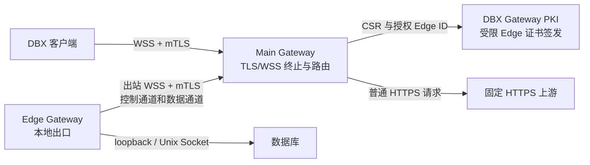

# DBX Gateway 设计规格

日期：2026-08-09

## 摘要

DBX Gateway 是一个面向 Linux 的独立网关程序，用于在不可信网络中保护 DBX 到数据库附近节点之间的流量。客户端和网关之间使用标准 TLS 1.3 与 WSS，不设计私有 TLS 变体，也不伪造浏览器指纹。网络链路上的普通节点可以观察连接地址、端口、流量大小和时序，但不能读取数据库协议内容。

同一个 `dbx-gateway` 可执行文件支持 Main 与 Edge 两种运行模式。DBX 只连接 Main；Edge 主动连接并注册到 Main，因此可部署在 NAT 后或不允许入站连接的数据库网络。Main 与 Edge 均由使用者控制，并被视为受信任节点。Main 会终止两侧 TLS、读取数据库协议字节并进行透明转发；Edge 会读取协议字节并建立到本机数据库的最终 TCP 或 Unix Socket 连接。网关不解析 SQL、不保存数据库账号，也不代替客户端执行数据库协议。

独立的 `dbx-gateway-pki` 可执行文件负责初始化 PKI、签发和吊销证书，也可作为受限的在线 Edge 证书签发服务。Edge 首次注册时在本机生成私钥与 CSR，通过一次性注册令牌向 Main 申请证书；Main 作为注册代理将经过授权的身份交给 PKI，私钥始终留在 Edge。

本子项目先交付 Gateway、PKI、部署示例和详细中文文档。DBX 连接编辑器中的链路示意图属于后续独立子项目，但 Gateway 会提供其所需的路由发现和阶段事件接口。

## 目标

- 在 DBX 到 Main、Main 到 Edge 两段不可信网络上使用标准 TLS 1.3 加密数据库流量。
- 支持 Main 与 Edge 两种部署模式，并允许 Edge 通过出站连接注册到 Main。
- 让 DBX 使用逻辑路由选择 Edge 和数据库目标，不接触 Edge 的实际网络地址。
- 使用 mTLS 区分 DBX 客户端与 Edge，并将 Edge ID 绑定到证书身份。
- 提供一次性令牌驱动的 Edge 自动领证、续期、吊销和离线手工签发流程。
- 在 Main 的同一 HTTPS 端口上为非 DBX 请求提供固定上游反向代理。
- 提供外部 TOML 配置、`--help`、配置检查、结构化日志和 systemd 部署示例。
- 为 Main、Edge、PKI、DBX 客户端接入、安全运维和故障处理提供详细中文文档。
- 发布 Linux x86_64 与 aarch64 可执行文件。

## 非目标

- 不把流量伪装成某个具体浏览器，也不承诺规避流量分类或统计分析。
- 不发明异化 HTTPS、自定义 TLS 握手或自有密码算法。
- 不让 Main 对数据库协议内容保持不可见。Main 是本设计中的受信任终止节点。
- 不实现通用正向代理、动态 URL 转发、缓存、负载均衡或 Nginx 配置语法兼容。
- 不在第一版实现一个 WSS 承载多个数据库连接的多路复用。
- 不在第一版实现 DBX 直连 Edge、自动直连回退或外部注册中心。
- 不代替数据库客户端执行登录、SQL 解析、查询重写或连接池管理。
- 不在第一版内置 ACME。公网证书由使用者提供，或使用 DBX Gateway PKI 签发的私有证书。
- 不把已有 SSH、SOCKS、HTTP Proxy 或 HTTP Tunnel 配置复用为 Gateway 配置。
- 不在本子项目实现连接编辑器中的链路示意图。

## 信任与可见性边界

### 信任假设

- DBX 客户端设备、Main 主机、Edge 主机和数据库主机由使用者控制并受信任。
- DBX 到 Main、Edge 到 Main 之间的交换机、路由器、无线网络、运营商网络和中间观察节点均不受信任。
- Main 可以读取完整数据库协议流量。协议中可能包含 SQL、库名、用户名、认证交换内容和结果数据，具体可见内容取决于数据库协议与数据库级 TLS 配置。
- Edge 可以读取最终转发的数据库协议流量。
- PKI 主机和持有签发中间 CA 私钥的账户属于高信任边界。

### 各段链路可见内容

| 链路 | 网络节点看到的内容 | 终止主机看到的内容 |
| --- | --- | --- |
| DBX 到 Main | Main IP、端口、通常可见的 SNI、TLS 版本、包大小、时序和长连接特征 | Main 解密后可见数据库协议字节 |
| Main 到 Edge | Main/Edge IP、端口、TLS 元数据、包大小和时序 | Main 与 Edge 均可见数据库协议字节 |
| Edge 到本机数据库 | 使用 loopback 或 Unix Socket 时不经过外部网络 | Edge 与数据库可见数据库协议字节 |
| Edge 到远程数据库 | 远程目标 IP、端口和未启用数据库 TLS 时的明文协议 | 路径中的网络节点可能读取协议内容 |

Edge 目标默认只允许 `127.0.0.1`、`::1` 或 Unix Socket。非 loopback TCP 目标必须逐目标显式启用，并在配置检查和运行日志中给出安全警告。需要跨不可信网络连接远程数据库时，应启用数据库自身 TLS，或把 Edge 部署到数据库主机。

操作系统级观察能力不由 TLS 隐藏。Main 或 Edge 主机上的管理员、EDR、eBPF、进程审计和套接字工具可以把连接关联到 `dbx-gateway` 进程。Gateway 对数据库发起的连接使用 Gateway 主机地址作为源地址，不携带 DBX 客户端原始 IP，且不启用透明代理或 PROXY protocol。

## 总体架构



### 可执行文件与源码边界

新增一个 Workspace crate：`crates/dbx-gateway`。该 crate 生成两个独立可执行文件：

- `dbx-gateway`：运行 Main 或 Edge，模式由 TOML 配置选择。
- `dbx-gateway-pki`：初始化 PKI、管理证书和令牌，也可运行受限在线签发服务。

共享配置类型、证书校验、协议消息和错误类型保留在同一个 crate 的内部模块中。第一版不创建单独的 protocol crate、插件接口或通用网关框架。

实现优先复用仓库已有技术栈，包括 Tokio、Axum、rustls、reqwest、serde、tracing 和项目现有错误处理模式。只有 X.509 生成、PKCS#12 导出或 CLI 解析确实缺少能力时才增加聚焦依赖。

## Main Gateway

### 监听与请求分类

Main 在一个配置端口上直接终止 TLS。TLS 配置允许普通浏览器在不提供客户端证书时完成握手，同时允许合法 DBX/Edge 客户端提交证书。握手之后按保留路径和证书身份分类：

1. 合法 DBX 客户端访问 DBX 数据路径时，进入客户端会话流程。
2. 合法 Edge 客户端访问控制或数据路径时，进入 Edge 流程。
3. 未认证客户端访问任一保留路径时，返回固定 `404`，不暴露路径用途和认证细节。
4. 其他普通 HTTP 请求转发到配置中唯一的固定 HTTPS 上游。

客户端提交不受信 CA 信任或格式无效的证书时，TLS 实现可能在握手阶段直接断开，无法返回自定义 HTTP 内容。未提交证书的普通客户端可以进入反向代理流程。

### 反向代理能力

Main 的普通 HTTPS 回退支持：

- HTTP/1.1 与 HTTP/2 请求；
- 流式请求体和响应体；
- Server-Sent Events；
- WebSocket 升级；
- 固定上游 URL 与常规转发头。

Main 不接受客户端指定目标，不实现开放代理、缓存、负载均衡、响应内容改写、Cookie 改写或 CSP 改写。保留路径永远不转发到普通上游。

如果 Main 前面部署 Nginx，Nginx 必须使用 TCP/TLS passthrough。若在 Nginx 上终止 TLS，Nginx 将能读取流量，Main 也无法直接执行本设计的客户端证书校验。默认部署方式是让 Main 直接监听公开 TLS 端口。

### Edge 注册表

Main 在内存中维护当前已认证 Edge 的状态：

- Edge ID；
- 证书序列号与指纹；
- 协议版本；
- 公开给 DBX 的逻辑目标列表；
- 最近心跳时间；
- 在线、离线或证书失效状态；
- 当前连接数与限制状态。

Edge 每 15 秒发送一次心跳。45 秒未收到心跳后标记离线。Main 把不含真实目标地址的最后已知 Edge 与路由元数据持久化到数据目录，以便 DBX 显示离线状态。Main 重启后不假定任何 Edge 在线，Edge 自动重连并重新注册；离线路由不能创建新连接。

同一 Edge ID 同时出现两个有效控制连接时，新连接默认被拒绝，并记录证书指纹和来源信息。管理员先撤销或断开旧实例后才能接管，避免无意的双活出口。

## Edge Gateway

### 启动与连接

Edge 只发起出站连接，不需要入站监听端口。启动流程为：

1. 读取配置与本地证书状态。
2. 若没有 Edge 证书，则执行一次性令牌注册流程。
3. 使用 Main CA 或 SPKI pin 校验 Main，建立 WSS/mTLS 控制通道。
4. 使用证书 URI SAN 中的 Edge ID 注册逻辑目标。
5. 每 15 秒发送心跳并接收创建数据通道的请求。

断线后采用带抖动的指数退避重连，退避上限为 60 秒。成功连接后重置退避。Main 重启或网络恢复后，Edge 自动重新注册。

### 目标配置

每个 Edge 目标包含稳定的 `target_id`、显示名称和本地地址。支持：

- IPv4 loopback TCP；
- IPv6 loopback TCP；
- Unix Socket；
- 明确设置 `allow_remote = true` 的非 loopback TCP。

注册消息只包含逻辑目标和安全展示信息。DBX 不接收目标的真实主机地址。Main 根据 ACL 决定哪些 DBX 客户端可以看到和使用哪些 `edge_id/target_id`。

### 数据通道

第一版每个数据库 TCP 连接使用一个独立 Edge WSS 数据通道：

1. DBX 向 Main 请求逻辑路由。
2. Main 校验 DBX 证书、ACL、Edge 在线状态和并发限制。
3. Main 通过 Edge 控制通道发送带随机会话 ID 的连接请求。
4. Edge 打开新的 WSS/mTLS 数据通道，并提交该会话 ID。
5. Main 以原子操作配对 DBX 与 Edge 数据通道。
6. Edge 连接本地目标，成功后向 Main 返回阶段结果。
7. Main 在两个已终止的 WSS 会话之间双向复制数据库字节。

会话 ID 使用密码学安全随机数，短时有效，只能消费一次，并绑定 Edge ID、目标 ID 和发起的 DBX 身份。重复、过期或不匹配的会话 ID 被拒绝。

控制通道断开时，该 Edge 的现有数据通道默认关闭。第一版不尝试保留失去控制面的会话，也不重放数据库字节，以免重复执行数据库操作。

## Gateway 协议

### 传输

- TLS 版本固定为 TLS 1.3。
- 禁用 TLS 0-RTT。
- 应用传输使用标准 WSS 二进制帧。
- 控制消息使用有版本字段的结构化消息。
- 数据帧保持数据库字节原样，不解析数据库协议。
- 配置请求帧、控制帧、数据帧、单连接缓冲区和全局内存上限，并实施背压。

### 协议兼容性

握手消息包含主版本与次版本。主版本不兼容时拒绝连接；次版本差异只能用于双方声明支持的向后兼容能力。错误响应仅在已加密且已认证的会话内返回，包含稳定错误码、可展示信息和可选重试建议，不包含证书、目标地址或内部堆栈。

### DBX 客户端流程

DBX 建立到 Main 的 WSS/mTLS 连接后，首个加密消息包含：

- 协议版本；
- 逻辑路由 `edge_id/target_id`；
- 客户端生成的连接请求 ID；
- 所需的阶段事件能力。

Main 依次返回下列阶段事件：

1. `main_authenticated`：Main TLS 与 DBX 客户端证书校验完成。
2. `route_authorized`：逻辑路由存在且 ACL 允许。
3. `edge_channel_ready`：Edge 在线且数据通道已配对。
4. `target_connected`：Edge 已连接本地数据库目标。
5. `stream_ready`：字节转发开始。

数据库认证由 DBX 原有驱动完成。后续链路示意图可在 `stream_ready` 后继续显示数据库认证成功或失败，但该阶段不属于 Gateway 协议。

## 证书与身份模型

### CA 角色分离

PKI 使用不同用途的签发链，禁止一张中间 CA 跨角色签发：

- Server CA：签发 Main HTTPS 服务端证书，证书只含 `serverAuth`。
- Edge CA：签发 Edge 身份证书，证书只含 `clientAuth`。
- DBX Client CA：签发 DBX 客户端证书，证书只含 `clientAuth`。
- RA 证书：可选远程 PKI 部署时认证 Main，权限仅限提交已经绑定 Edge ID 的 CSR。

根 CA 默认离线保存。在线 PKI 服务只持有受限的 Edge 中间 CA 私钥，不能签发 Server 或 DBX Client 证书。

### Edge 身份绑定

Edge 证书必须包含 URI SAN：

```text
urn:dbx-gateway:edge:<edge-id>
```

Main 校验：

- 证书链由 Edge CA 签发；
- EKU 包含且仅允许客户端认证用途；
- URI SAN 中的 Edge ID 与注册消息一致；
- 证书在有效期内；
- 序列号或指纹未被吊销；
- 协议版本可兼容。

Main 不接受仅依赖 Common Name 的 Edge 身份。CSR 中自行声明的 CN 或 SAN 不构成授权依据。

### Edge 自动领证

自动领证采用一次性令牌与本地 CSR：

1. 管理员使用 PKI 管理命令为一个确定的 Edge ID 创建一次性注册令牌。
2. PKI 只保存令牌哈希。令牌默认 10 分钟过期、只能使用一次，并绑定 Edge ID。
3. 管理员通过安全渠道把令牌、Main URL 和 Main CA/SPKI pin 交给 Edge。
4. Edge 在本机生成不可导出的私钥和 CSR，私钥权限为仅运行用户可读。
5. Edge 使用服务器单向 TLS 连接 Main 的保留注册路径，并提交令牌与 CSR。
6. Main 对注册请求执行大小限制、速率限制和格式检查，确认声明的 Edge ID 位于 Main 允许列表，再通过受认证的 PKI 通道转交令牌、Edge 声明 ID 与 CSR。
7. PKI 原子校验并消费令牌，以令牌绑定的 Edge ID 作为唯一授权身份；同时验证 Edge 声明 ID、CSR 私钥持有证明，忽略 CSR 请求的身份字段，并生成对应 URI SAN。
8. PKI 返回 Edge 证书与证书链。Main 将其通过已加密的注册连接返回 Edge。
9. Edge 原子保存证书，销毁内存中的令牌，并用 WSS/mTLS 重新连接 Main 完成正式注册。

PKI 完成签发时令牌立即失效，即使证书响应随后因网络中断未送达 Edge，也不能重放该令牌。并发重复提交只能有一个成功。响应丢失时，管理员使用显式 `--replace` 创建新令牌；PKI 先吊销该 Edge ID 上一次签发但未完成注册的证书，再允许重新注册。对已经在线的 Edge 使用 `--replace` 会中断现有连接，CLI 必须要求交互确认或显式 `--yes`。PKI 不接收、生成或回传 Edge 私钥。

### PKI 部署方式

推荐把 `dbx-gateway-pki serve` 与 Main 部署在同一受控主机，通过 Unix Socket 通信。Unix Socket 使用独立系统用户与最小文件权限。远程部署 PKI 时必须使用 HTTPS/mTLS，Main 使用受限 RA 证书，PKI 仅接受允许的 Main 身份。

不需要自动领证时，可以不运行在线 PKI。管理员使用 `dbx-gateway-pki edge issue --id <edge-id>` 离线签发，再把证书与私钥安全部署到 Edge。

### 续期、重签与吊销

- 未过期且未吊销的 Edge 使用当前证书认证续期，并在本机生成新私钥与 CSR。
- PKI 只签发同一 Edge ID，不允许续期请求改变身份。
- 证书过期、私钥丢失或被吊销后，必须创建新的 Edge 注册令牌重新领证。
- Main 定期重载吊销列表。证书被吊销时，关闭对应控制通道和所有数据通道。
- Server 与 DBX Client 证书支持离线续期和吊销。
- 每个 DBX 设备使用独立客户端证书，禁止多人共享一个 PKCS#12 文件。

DBX 客户端证书导出为带密码的 PKCS#12。私钥导入操作系统安全存储，连接配置和云同步只保存证书身份 ID，不保存私钥、PKCS#12 内容或导入密码。

## DBX 集成边界

### 新传输层类型

DBX 新增独立的 `dbx_gateway` 传输层，不扩展现有 `proxy_type`。Gateway 的 WSS、mTLS、证书 pin、逻辑路由和证书生命周期与 SOCKS/HTTP Proxy 不同，也不复用轮询式 `HttpTunnelManager`。

新增 `DbxGatewayManager` 负责：

- 读取共享 Gateway 配置；
- 从操作系统安全存储加载客户端身份；
- 校验 Main CA 或 SPKI pin；
- 查询当前证书可见的逻辑路由；
- 建立数据库字节流；
- 向连接测试流程报告 Gateway 阶段事件。

共享 Gateway 配置保存 Main URL、客户端证书身份 ID、Main CA/SPKI pin、连接超时和显示名称。具体数据库连接只保存逻辑路由 `edge_id/target_id`。

### 路由发现

Main 只返回当前 DBX 客户端证书有权查看的路由。路由列表按 Edge 分组，包含在线状态、目标显示名称和稳定 ID，不包含 Edge 的真实网络地址。离线 Edge 可以显示在已有配置中，但不能用于新建连接。

第一版所有流量都经过 Main。客户端不尝试发现或直连 Edge。

### 与链路示意图的接口

后续连接编辑器可展示：

```text
DBX -> Main Gateway -> Edge Gateway -> Database
```

它复用 Gateway 阶段事件，不额外并行探测。连接配置变化后状态重置为未测试；测试时依照真实连接顺序显示进行中、成功、首个失败与后续未测试节点。数据库级 TLS 作为数据库节点上的锁标识，不作为独立网络节点。

## 配置模型

### 通用规则

- 配置文件使用 TOML，由 `--config` 指定。
- 相对路径以配置文件所在目录为基准解析。
- 数据目录、日志级别、监听端口、证书路径、超时和限制均可配置。
- 配置中的未知字段默认报错，避免拼写错误被静默忽略。
- 私钥、令牌明文和 PKCS#12 密码不得写入日志。
- 敏感文件必须通过权限检查；权限过宽时默认拒绝启动。

### Main 配置范围

Main 配置至少覆盖：

- `mode = "main"`；
- 监听地址与端口；
- 数据目录；
- Server 证书与私钥；
- Edge CA、DBX Client CA、吊销列表；
- 保留路径；
- 固定 HTTPS 回退上游；
- PKI Unix Socket 或远程 mTLS 地址；
- 允许注册的 Edge ID 列表；
- DBX 客户端到逻辑路由的 ACL；
- 心跳、握手、连接、空闲和关闭超时；
- 每客户端和每 Edge 并发限制；
- 请求速率、帧大小、缓冲区和全局内存限制；
- 日志格式与级别。

### Edge 配置范围

Edge 配置至少覆盖：

- `mode = "edge"`；
- Edge ID；
- Main URL；
- Main CA 或 SPKI pin；
- 数据目录；
- Edge 证书与私钥；
- 首次注册令牌文件；
- 逻辑目标列表；
- 重连、连接和空闲超时；
- 最大数据通道数；
- 日志格式与级别。

注册令牌通过权限受限的独立文件或一次性标准输入提供，不直接写入长期 TOML。注册成功后，程序删除令牌文件；删除失败时拒绝继续常驻，并提示管理员处理，避免令牌残留被误认为仍有效。

### 配置重载

Main 和 Edge 接收 `SIGHUP` 后加载并完整校验新配置，再原子替换可热更新部分。校验失败时继续使用旧配置并记录明确错误。监听地址、运行模式和数据目录变化需要重启；ACL、目标、证书链、吊销列表、限制和日志级别支持热更新。

吊销列表更新后立即关闭受影响的活动会话。删除 Edge 目标时不创建新会话，现有会话默认关闭，避免已撤销目标继续可达。

## CLI 设计

### `dbx-gateway`

```text
dbx-gateway --help
dbx-gateway --version
dbx-gateway serve --config /etc/dbx-gateway/main.toml
dbx-gateway check-config --config /etc/dbx-gateway/main.toml
```

`check-config` 不启动长期服务，检查 TOML、文件路径、证书链、证书用途、私钥匹配、文件权限、监听地址可用性、上游 URL、ACL 引用和目标安全策略。成功返回 0；配置错误返回稳定的非零退出码。

### `dbx-gateway-pki`

```text
dbx-gateway-pki --help
dbx-gateway-pki --version
dbx-gateway-pki init --config /etc/dbx-gateway/pki.toml
dbx-gateway-pki serve --config /etc/dbx-gateway/pki.toml
dbx-gateway-pki server issue --name main --dns gateway.example.com
dbx-gateway-pki server renew --name main
dbx-gateway-pki client issue --name laptop-01
dbx-gateway-pki client revoke --serial <serial>
dbx-gateway-pki client list
dbx-gateway-pki edge issue --id edge-prod-01
dbx-gateway-pki edge renew --id edge-prod-01
dbx-gateway-pki edge revoke --serial <serial>
dbx-gateway-pki enrollment create --edge-id edge-prod-01 --ttl 10m
dbx-gateway-pki enrollment create --edge-id edge-prod-01 --ttl 10m --replace
dbx-gateway-pki enrollment list
dbx-gateway-pki enrollment revoke --id <enrollment-id>
```

所有命令提供子命令级 `--help`。标准输出用于机器可读结果或明确成功信息，标准错误用于诊断。默认不输出私钥、令牌哈希、导出密码和敏感配置。创建注册令牌时只显示一次明文令牌。

## 数据目录与权限

推荐 Linux 文件布局：

```text
/etc/dbx-gateway/
  main.toml | edge.toml | pki.toml
  certs/
/var/lib/dbx-gateway/
  state/
  revocations/
/run/dbx-gateway/
  pki.sock
```

发布包提供独立的 `dbx-gateway` 与 `dbx-gateway-pki` systemd 用户。Main/Edge 运行账户无权读取根 CA 和中间 CA 私钥。在线 PKI 账户只能读取 Edge 中间 CA 私钥，不能读取 Server 或 DBX Client CA 私钥。服务默认启用合理的 systemd 加固项，包括只读系统目录、私有临时目录、无新权限和受限写目录。

私钥持久化使用 PKCS#8 PEM，并要求仅所有者可读。PKI 根私钥和离线中间 CA 私钥使用口令加密；口令通过交互输入或 systemd credentials 提供，不写入 TOML 和命令行参数。

## 安全控制

- TLS 1.3，禁用 0-RTT 和明文降级。
- DBX 和 Edge 均校验专用 CA/SPKI pin，不回退到系统根证书，也不提供忽略证书错误选项。
- Edge ID 绑定证书 URI SAN，CSR 不能自行决定授权身份。
- DBX 客户端 ACL 默认拒绝，按证书身份授权逻辑路由。
- 目标地址解析后重新校验实际 IP，防止 DNS 重绑定绕过规则。
- loopback、link-local、云元数据地址和远程目标分别应用明确策略；Edge 默认只允许 loopback 与 Unix Socket。
- 限制每客户端连接数、建立速率、空闲时间、帧大小、缓冲区和总内存。
- 双向复制实施背压，慢消费者不能无限占用内存。
- 普通 HTTPS 回退只有一个固定上游，保留路径从不回退。
- 日志记录身份 ID、证书指纹、逻辑路由、阶段、字节计数和错误码，不记录数据库载荷、SQL 或认证内容。
- panic、协议错误和上游错误不会把内存中的数据库字节写入日志。
- 生产构建禁用可泄露敏感内存的自动核心转储，文档说明如何在 systemd 中验证。
- 更新包签名私钥不得与任何 Gateway CA 或客户端私钥复用。

## 错误处理与可观测性

### 稳定错误类别

- Main TLS 或 pin 校验失败；
- 客户端证书缺失、过期、用途错误或已吊销；
- Edge 证书身份与声明 ID 不一致；
- 协议版本不兼容；
- 路由不存在或 ACL 拒绝；
- Edge 离线或并发已满；
- 数据通道配对超时；
- Edge 本地目标连接失败；
- 注册令牌无效、过期、已使用或身份不匹配；
- PKI 不可用或签发失败；
- 固定回退上游不可用；
- 配置或文件权限错误。

未认证请求只得到普通 `404` 或 TLS 失败。已认证会话得到结构化错误码和安全信息。DBX 可把安全信息显示在连接测试结果中，完整内部原因只写 Main/Edge 日志，且经过敏感字段清理。

### 日志与健康检查

支持文本与 JSON 日志，默认写 stdout/stderr 供 systemd 收集。每条会话日志包含可关联的请求 ID，但不记录数据载荷。

Main 提供仅本机或单独管理监听地址可访问的健康检查，分别报告进程存活、证书有效期、PKI 连接和在线 Edge 数量。公开 TLS 端口不暴露管理状态。Edge 健康检查报告控制通道、证书有效期和本地目标配置状态，但不主动登录数据库。

## 详细文档交付

实现必须同时交付下列中文文档，不以只有命令清单的 README 代替：

### `docs/dbx-gateway.md`

总览与入口文档，包含：

- 适用场景与非适用场景；
- Main、Edge、PKI、DBX 客户端之间的拓扑图；
- 各段链路可见内容和 Main 可读数据库协议的明确警告；
- 最小部署路径；
- 文档导航；
- 版本兼容与升级入口。

### `docs/dbx-gateway/main-gateway.md`

- Linux x86_64/aarch64 安装和校验发布文件；
- 创建运行用户、目录和权限；
- Server 证书安装；
- Main TOML 完整示例；
- ACL、固定 HTTPS 回退、端口和防火墙；
- PKI Unix Socket 与远程 PKI 两种连接方式；
- systemd 安装、启动、重载、停止和开机启动；
- Nginx TCP passthrough 注意事项；
- 健康检查、日志读取、升级、回滚和卸载；
- Main 常见错误及逐步排查方法。

### `docs/dbx-gateway/edge-gateway.md`

- Edge 的网络前提和无入站端口部署；
- 创建 Edge ID 与一次性注册令牌；
- 安全传递 Main CA/SPKI pin 与令牌；
- Edge 首次自动领证的逐步操作和预期输出；
- loopback、Unix Socket 和显式远程目标配置；
- Edge TOML 完整示例；
- systemd 安装和最小权限；
- 自动重连、心跳、证书续期、私钥丢失和重新注册；
- Main 重启、Edge 离线、目标不可达的排障流程；
- Edge 迁移到新主机和安全下线。

### `docs/dbx-gateway/pki.md`

- PKI 信任模型和 CA 角色分离；
- 离线根 CA 初始化与备份；
- Server、DBX Client、Edge 中间 CA 的用途；
- 在线 Edge PKI 的 Unix Socket 推荐部署；
- 远程 PKI 的 mTLS 与 RA 证书部署；
- 一次性注册令牌的创建、吊销、过期和审计；
- Server、DBX Client、Edge 的签发、续期、吊销和列表命令；
- PKCS#12 导出与 DBX 导入；
- CA 和服务证书轮换；
- 灾难恢复、备份验证与私钥泄露处置；
- 明确禁止复用更新签名密钥。

### `docs/dbx-gateway/configuration.md`

- Main、Edge、PKI 每个 TOML 字段的类型、默认值、是否可热更新和安全影响；
- 所有超时、限制和路径解析规则；
- ACL 与逻辑路由示例；
- 固定回退上游示例；
- 安全的内网、公网和数据库同机 Edge 配置示例；
- `check-config` 的退出码和诊断说明。

### `docs/dbx-gateway/operations.md`

- 日常状态检查清单；
- 证书到期监控；
- 日志字段和结构化错误码；
- 配置重载、版本升级、回滚、备份和恢复；
- Edge 注册、掉线、重复 ID、目标失败和 PKI 不可用排障；
- 使用抓包验证外部链路只有 TLS/WSS 的方法；
- 验证 Edge 到数据库是否保持 loopback/Unix Socket 的方法；
- 卸载时证书吊销与数据清理顺序。

### 示例文件

发布包和仓库同时提供：

```text
examples/dbx-gateway/main.toml
examples/dbx-gateway/edge.toml
examples/dbx-gateway/pki.toml
examples/dbx-gateway/systemd/dbx-gateway-main.service
examples/dbx-gateway/systemd/dbx-gateway-edge.service
examples/dbx-gateway/systemd/dbx-gateway-pki.service
```

文档中的所有命令必须可直接执行，并说明命令运行主机、运行用户、预期结果、失败恢复方式和涉及的敏感文件。示例域名、Edge ID、路径和端口保持一致，避免读者跨章节替换多组占位符。

## 发布与部署

CI 为 Linux x86_64 和 aarch64 生成：

- `dbx-gateway`；
- `dbx-gateway-pki`；
- 示例配置；
- systemd unit；
- 中文文档；
- SHA-256 校验文件。

第一版不提供容器镜像作为必需部署方式。原生二进制与 systemd 是主路径，减少容器网络和卷权限对证书排障的干扰。后续只有在存在明确部署需求时再增加容器示例。

## 测试策略

### 单元测试

- TOML 默认值、未知字段拒绝、路径解析和权限校验；
- URI SAN Edge ID 解析和声明 ID 匹配；
- CA 角色、EKU、有效期、吊销和 pin 校验；
- 一次性令牌哈希、过期、单次消费和 Edge ID 绑定；
- CSR 私钥持有证明与 PKI 忽略 CSR 身份字段；
- ACL、逻辑路由和目标地址策略；
- 会话 ID 绑定、过期与防重放；
- 限流、缓冲上限和稳定错误码。

### 集成测试

- DBX 测试客户端经 Main、Edge 到本地 echo server 的完整字节往返；
- Edge 位于只允许出站连接的测试网络时仍可注册和转发；
- 两个 Edge 提供不同逻辑目标，ACL 只返回授权路由；
- Main 重启后 Edge 自动重新注册；
- 控制通道断开后现有数据通道按设计关闭；
- 重复 Edge ID 被拒绝；
- 每个数据库连接创建一个数据 WSS，关闭后无泄漏任务；
- 非 DBX HTTPS、HTTP/2、SSE 和 WebSocket 正确转发到固定上游；
- 未认证保留路径返回 `404` 且不进入回退上游；
- 吊销 Edge 或 DBX 客户端证书后活动会话立即关闭；
- 在线 PKI 不持有根 CA，不能签发非 Edge 证书；
- 令牌重放、CSR 身份篡改和错误 Main pin 均失败关闭。

### 网络与安全验证

- 抓取 DBX 到 Main 和 Edge 到 Main 的流量，只能看到 TLS/WSS 与流量元数据，不能搜索到测试 SQL 或凭据明文；
- 在 Main 进程内部的受控测试钩子能够确认 Main 确实转发原始数据库字节，验证文档所述信任边界；
- Edge 使用 loopback 或 Unix Socket 时，外部网卡抓包不出现数据库协议流量；
- 配置远程明文目标时，`check-config` 与运行日志都产生明确警告；
- 慢客户端、超大帧和连接洪泛受限制且内存保持在配置上限内。

### 文档验证

在全新支持的 Linux 虚拟机上，按文档从零完成：

1. 初始化离线根 CA 和各角色中间 CA。
2. 部署在线 Edge PKI。
3. 部署 Main 并验证普通 HTTPS 回退。
4. 创建一次性令牌并部署 Edge。
5. 让 Edge 自动领证、注册目标并保持心跳。
6. 在 DBX 导入客户端证书并连接数据库。
7. 完成续期、吊销、重新注册、升级和回滚演练。

任何需要阅读源码、猜测目录或补充未记录参数才能完成的步骤都视为文档验收失败。

## 验收标准

- DBX 能通过一个逻辑路由经 Main 与 Edge 连接数据库，DBX 不需要知道 Edge 地址。
- Edge 在无入站端口和 NAT 后可主动注册，并在 Main 重启后自动恢复。
- DBX 到 Main、Edge 到 Main 的抓包不含数据库协议明文。
- Main 与 Edge 可以读取数据库协议字节，行为与文档中的信任边界一致。
- Edge 默认只连接 loopback 或 Unix Socket；远程目标需要显式放行并产生警告。
- Edge 首次注册时私钥只在 Edge 本机生成，Main 和 PKI 从不接收私钥。
- 一次性令牌绑定 Edge ID、默认 10 分钟过期、只能成功使用一次。
- 另一张证书不能注册为相同 Edge ID，身份由 URI SAN、CA 角色和吊销状态共同约束。
- DBX 客户端只能发现和连接其证书 ACL 允许的逻辑路由。
- 非 DBX HTTPS 请求可由同一 Main 端口转发到固定上游，保留路径不泄露且不回退。
- `dbx-gateway` 与 `dbx-gateway-pki` 的顶层和子命令 `--help` 完整可用。
- `check-config` 能在启动前发现证书、权限、ACL、目标和上游配置错误。
- Linux x86_64 与 aarch64 发布产物、示例配置、systemd unit 和全部中文文档同时生成。
- 新 Linux 环境可仅凭文档完成 Main、Edge、PKI 部署、领证、DBX 接入、续期、吊销和故障恢复。

## 实施顺序

1. 建立 Gateway crate、CLI、配置模型和证书校验基础。
2. 实现 PKI 离线命令、角色分离和证书测试。
3. 实现 Main/Edge 控制通道、身份注册和心跳。
4. 实现单连接数据通道与本地目标转发。
5. 实现 Edge 自动领证和在线受限 PKI。
6. 实现 Main 固定 HTTPS 回退、ACL、限流和热重载。
7. 集成 DBX 的 `dbx_gateway` 传输层、系统安全存储和路由选择。
8. 完成 Linux 发布、systemd 示例、详细文档与从零部署验证。
9. Gateway 子项目验收后，另行设计并实现连接编辑器链路示意图。
